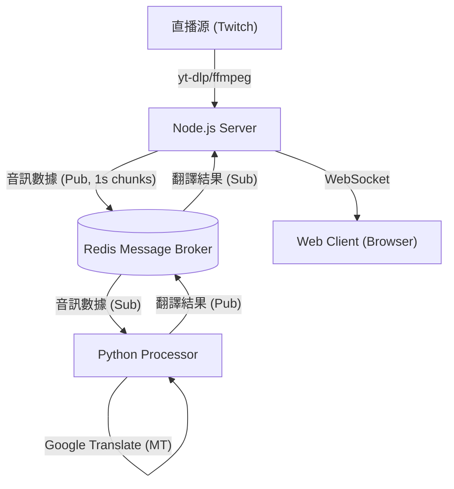

# Live Stream Real-time Translation System (直播實時翻譯系統) v2.0

這是一個高效能的實時直播翻譯系統，專為 Twitch 等直播平台設計。它利用 **Faster-Whisper** 進行極速語音轉文字（ASR），並結合 **Google Translate** 實現即時日中翻譯，最後透過 WebSocket 將字幕推送到 Web 客戶端。


## ✨ 核心特色 (v2.0)

*   **🚀 極速轉錄 (Faster-Whisper)**：採用 CTranslate2 加速的 `faster-whisper` 實作，比原始 OpenAI Whisper 快 4-5 倍，並大幅降低 VRAM 佔用。
*   **🧠 智能滑動視窗**：實作 5 秒緩衝與 1.5 秒重疊（Sliding Window）機制，有效解決語句被切斷的問題，大幅提升長句識別率。
*   **🔇 語音活動偵測 (VAD)**：內建 VAD 過濾器，自動忽略靜音片段，減少無效請求與幻覺。
*   **🛡️ 抗幻覺過濾**：針對直播場景優化，自動過濾「ご視聴ありがとうございました」、「字幕」等常見 AI 幻覺與重複語句。
*   **⚡ GPU 加速**：完整支援 NVIDIA CUDA 加速（Float16/Int8 量化），在消費級顯卡上也能流暢運行 `large-v3` 模型。
*   **🌐 實時 Web UI**：現代化響應式介面，支援深色模式，即時顯示轉錄原文與翻譯結果。

## 🏗️ 系統架構

系統由三個主要 Docker 容器組成，透過 Redis 進行高效能通訊：



1.  **Node.js Server**: 負責串流抓取，將音訊切割成 1 秒的小塊發送至 Redis，並作為 WebSocket 伺服器廣播結果。
2.  **Redis**: 高效能訊息佇列，解耦音訊擷取與 AI 處理。
3.  **Python Processor**: 核心處理單元。維護一個 5 秒的滑動音訊緩衝區，執行 VAD、ASR 和翻譯，並具備上下文記憶功能。

## 🚀 快速開始

### 前置需求

*   **Docker** & **Docker Compose**
*   **NVIDIA GPU** (強烈建議): 需安裝 [NVIDIA Container Toolkit](https://docs.nvidia.com/datacenter/cloud-native/container-toolkit/install-guide.html)。
    *   *系統預設配置為 GPU 模式，若無 GPU 需修改 `docker-compose.yml` 和 `processor.py`。*

### 安裝與執行

1.  **複製專案**
    ```bash
    git clone https://github.com/YourUsername/live-stream-translate.git
    cd live-stream-translate
    ```

2.  **啟動服務**
    使用 Docker Compose 一鍵啟動：
    ```bash
    docker-compose up --build
    ```
    *首次啟動會下載 `large-v3` 模型 (約 3GB) 和 Docker 映像檔，請耐心等待。*

3.  **開啟客戶端**
    在瀏覽器中訪問 `client.html` (或部署後的網址)。
    *   預設 WebSocket 地址: `ws://localhost:8080`

## ⚙️ 配置說明

### 1. 修改直播源
目標直播 URL 定義在 `server/server.js` 中：

```javascript
// server/server.js
const LIVE_PAGE_URL = 'https://www.twitch.tv/nekoko88'; // 修改此處
```
修改後需重啟 Server 容器：`docker-compose restart server`

### 2. 調整 AI 模型
在 `docker-compose.yml` 中可以調整模型大小與參數：

```yaml
environment:
  # 可選: tiny, base, small, medium, large-v2, large-v3
  ASR_MODEL_NAME: large-v3
```

### 3. 調整緩衝與延遲
在 `processor/processor.py` 中可以調整滑動視窗參數：

```python
BUFFER_DURATION_S = 5.0   # 緩衝區長度 (秒)
OVERLAP_DURATION_S = 1.5  # 重疊長度 (秒)
```
*較長的緩衝區能提升準確度，但會增加字幕顯示的延遲。*

## 🛠️ 技術棧

*   **Frontend**: HTML5, CSS3 (Modern UI), JavaScript (WebSocket)
*   **Backend**: Node.js, Express, `fluent-ffmpeg`, `yt-dlp`
*   **AI Core**: 
    *   Python 3.10+
    *   **Faster-Whisper** (CTranslate2 backend)
    *   **PyTorch** (CUDA support)
    *   Deep Translator
*   **Infrastructure**: Docker, Redis 8.x

## 📝 常見問題

*   **Q: 為什麼字幕有延遲？**
    *   A: 為了保證語意完整，系統會緩衝 5 秒的音訊進行識別。加上直播本身的延遲與運算時間，總延遲約為 5-8 秒是正常的。
*   **Q: 如何解決 WSL2 Docker 權限錯誤？**
    *   A: 如果遇到 `failed to write file` 錯誤，請嘗試重啟 Docker Desktop 或執行 `wsl --shutdown` 重置子系統。
*   **Q: 支援哪些語言？**
    *   A: 目前預設配置為 **日文 -> 繁體中文**。可在 `processor.py` 中修改 `SOURCE_LANG_CODE` 和 `TARGET_LANG_CODE` 來支援其他語言。

## 🤝 貢獻

歡迎提交 Issue 或 Pull Request 來改進這個專案！

## 📄 授權

ISC License
