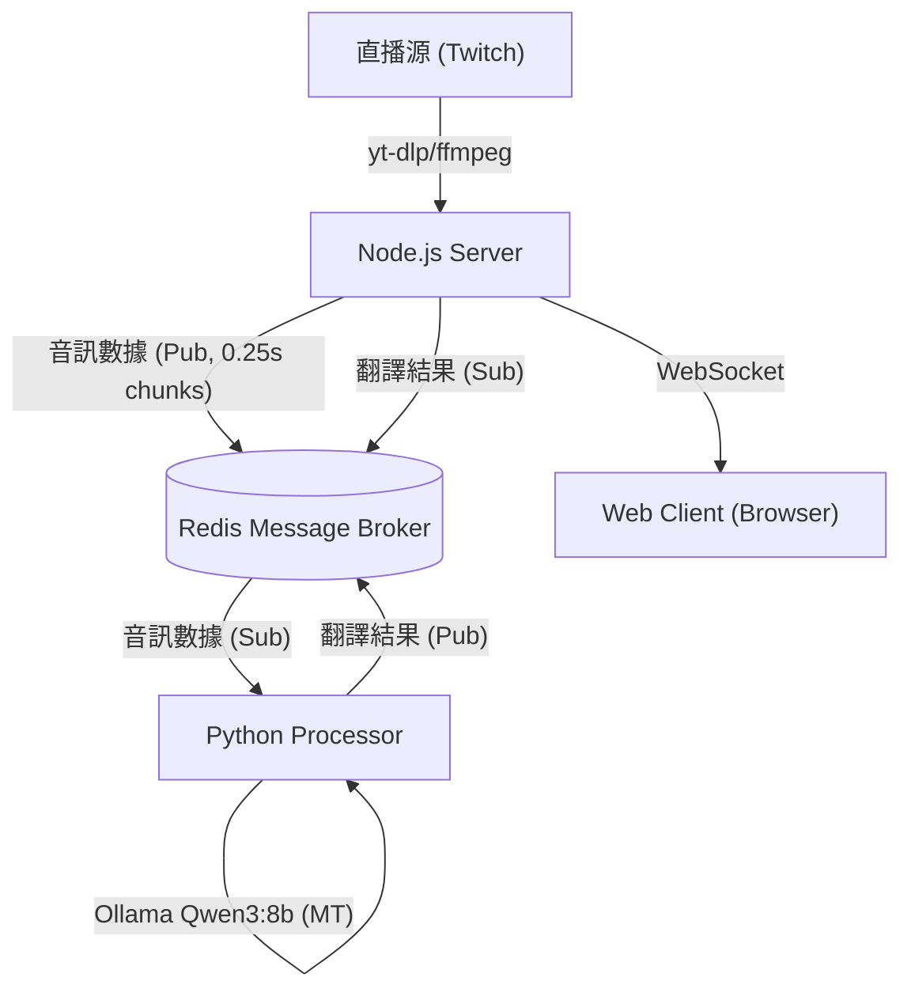

# 🎙️ Live Stream Real-time Translation System (直播即時翻譯系統) v2.3.3

一個高效能的實時直播翻譯系統，專為日文直播設計。採用 **Kotoba-Whisper v2.2**（日文優化 ASR）+ **Ollama Qwen3:8b**（本地 LLM 翻譯）架構，透過 WebSocket 將翻譯結果即時推送到 Web 客戶端。


## ✨ v2.3.3 核心特色

### 🧠 AI 引擎升級
- **Kotoba-Whisper v2.2**：日文優化 ASR，支援標點且幻覺少
- **Ollama Qwen3:8b**：本地 LLM 翻譯，隱私安全；支援低 VRAM 模式
- **stable-ts 整合**：時間戳對齊與 VAD 增強，提升識別精度

### ⚡ 效能優化
- **CUDA 12.8 / RTX 50 相容**：基底映像改為 `nvidia/cuda:12.8.0-cudnn-runtime-ubuntu22.04`
- **PyTorch 2.7.0 + cu128**：與 RTX 50 系列 sm_120 相容，torchaudio 同步版本
- **分層快取 Dockerfile**：torch/torchaudio/ASR/Transformers 分層安裝，搭配 BuildKit pip cache，重建更快
- **程式啟動優化**：延遲載入 numpy/LLM/ASR 函數，Redis 連線重試，HTTP 連線池 DNS cache
- **智能緩衝**：5 秒滑動視窗 + 1.5 秒重疊，兼顧延遲與上下文

### 🛡️ 翻譯品質
- **多層幻覺過濾**：ASR 幻覺檢測、重複詞過濾、無意義音譯過濾
- **OpenCC 繁簡轉換**：自動將簡體轉換為台灣繁體用語
- **中台用語轉換**：「視頻→影片」、「軟件→軟體」等在地化

### 🌐 現代化介面
- **響應式 Web UI**：深色模式、自動滾動、訊息上限控制
- **事件委派優化**：高效 DOM 操作，流暢處理大量訊息

## 🏗️ 系統架構

系統由四個 Docker 容器組成，透過 Redis 進行高效能通訊：



### Docker 服務組成

| 服務 | 說明 | 埠口 |
|------|------|------|
| `redis` | Redis 8.x 訊息佇列 | 6379 (內部) |
| `ollama` | Ollama LLM 服務 + Qwen3:8b | 11434 (內部) |
| `processor` | Python ASR + 翻譯處理器 | - |
| `server` | Node.js WebSocket 伺服器 | 8080 |

## 🚀 快速開始

### 硬體需求

| 項目 | 最低需求 | 建議配置 |
|------|----------|----------|
| GPU | NVIDIA GTX 1080 (8GB VRAM) | RTX 3080+ / RTX 50 系列 |
| RAM | 16GB | 32GB |
| 硬碟 | 20GB 可用空間 | SSD 推薦 |

### 軟體需求

- **Docker** & **Docker Compose**
- **NVIDIA Container Toolkit** ([安裝指南](https://docs.nvidia.com/datacenter/cloud-native/container-toolkit/install-guide.html))
- **CUDA 12.x** 驅動程式

### 安裝步驟

1. **複製專案**
   ```bash
   git clone https://github.com/Chiyan54554/live-stream-translate.git
   cd live-stream-translate
   ```

2. **建立 Ollama 模型持久化 Volume**
   ```bash
   docker volume create live-stream-translate_ollama_models
   ```

3. **啟動服務**
    - PowerShell：
       ```powershell
       $env:DOCKER_BUILDKIT=1; docker compose up --build
       ```
    - bash：
       ```bash
       DOCKER_BUILDKIT=1 docker compose up --build
       ```
   > ⏳ 首次啟動會下載：
   > - Kotoba-Whisper v2.2 模型 (~3GB)
   > - Qwen3:8b LLM 模型 (~5GB)
   > - Docker 基礎映像檔

4. **開啟客戶端**
   
   瀏覽器訪問：`http://localhost:8080`

## ⚙️ 配置說明

### 修改直播源

編輯 `server/server.js`：

```javascript
const LIVE_PAGE_URL = 'https://www.twitch.tv/your_streamer';
```

支援平台：
- ✅ Twitch
- ✅ YouTube Live
- ✅ 其他 yt-dlp 支援的平台

### 更換 ASR 模型

編輯 `docker-compose.yml` 中的 `processor` 環境變數：

```yaml
environment:
  # 日文優化（推薦）
  ASR_MODEL_NAME: kotoba-tech/kotoba-whisper-v2.2
  
  # 備選方案
  # ASR_MODEL_NAME: kotoba-tech/kotoba-whisper-v2.1  # 幻覺更少
  # ASR_MODEL_NAME: large-v3                          # 標準 Whisper
```

#### 改用 Google Speech-to-Text（雲端）

1. 下載並儲存 GCP 服務帳戶 JSON，並在 `docker-compose.yml` 掛載：
    ```yaml
    services:
       processor:
          volumes:
             - ./gcp-sa.json:/app/keys/gcp-sa.json:ro
    ```
    > 你也可以使用自己的檔名（例如 `nodal-alloy-....json`），記得同步更新 volume 路徑與 `GOOGLE_APPLICATION_CREDENTIALS`。

2. 啟用 Google STT 並指定憑證路徑（支援 `latest_short` / `latest_long` 模型）：
    ```yaml
    services:
       processor:
          environment:
             USE_GOOGLE_STT: "1"
             GOOGLE_APPLICATION_CREDENTIALS: /app/keys/gcp-sa.json
             GOOGLE_STT_MODEL: latest_short  # 選填，預設 latest_short
    ```
    > 提示：Google STT 會跳過本地 Whisper，減少 GPU 負載；語言代碼沿用 `SOURCE_LANG_CODE`（預設 ja）。

### 更換 LLM 模型

編輯 `docker-compose.yml`：

```yaml
environment:
  LLM_MODEL: "qwen3:8b"          # 預設（推薦）
  # LLM_MODEL: "qwen2.5:7b"       # 備選
  # LLM_MODEL: "llama3.1:8b"      # 英文更強
```

#### 改用 Google Cloud Translation（雲端翻譯）

1. 確認 `processor` 服務已掛載 GCP 憑證並設定 `GOOGLE_APPLICATION_CREDENTIALS`。
2. 在 `docker-compose.yml` 啟用 Cloud Translation：
    ```yaml
    services:
       processor:
          environment:
             USE_CLOUD_TRANSLATION: "1"
             CLOUD_TRANSLATE_PROJECT_ID: "your-gcp-project-id"
             # 可選：CLOUD_TRANSLATE_LOCATION: global
             # 可選：CLOUD_TRANSLATE_TIMEOUT: 8
    ```
3. 啟用後會改用 Cloud Translation，Ollama 不再參與翻譯（仍可保留作備援，將 USE_CLOUD_TRANSLATION 設回 0 即可）。

### 調整緩衝參數

編輯 `processor/config.py`：

```python
BUFFER_DURATION_S = 5.0   # 緩衝區長度（秒）- 越長準確度越高，延遲越大
OVERLAP_DURATION_S = 1.5  # 重疊長度（秒）- 防止句子被切斷
```

## 📁 專案結構

```
live-stream-translate/
├── client.html              # Web 客戶端介面
├── docker-compose.yml       # Docker Compose 配置
├── Dockerfile.server        # Node.js Server Dockerfile
├── README.md
│
├── ollama/
│   ├── Dockerfile.ollama    # Ollama 服務 Dockerfile
│   └── entrypoint.sh        # 啟動腳本（自動載入模型）
│
├── processor/
│   ├── Dockerfile.processor # Python 處理器 Dockerfile
│   ├── requirements.txt     # Python 依賴
│   ├── config.py            # 配置參數
│   ├── main.py              # 主程式入口
│   ├── asr.py               # ASR 模組（Kotoba-Whisper）
│   ├── translator.py        # LLM 翻譯模組
│   ├── text_utils.py        # 文字處理工具
│   └── mappings/            # 用語轉換表
│       ├── china_to_taiwan.txt
│       └── simplified_to_traditional.txt
│
└── server/
    ├── package.json
    └── server.js            # Node.js WebSocket 伺服器
```

## 🛠️ 技術棧

| 層級 | 技術 |
|------|------|
| **Frontend** | HTML5, CSS3 (Dark Mode), Vanilla JS |
| **Backend** | Node.js 25.x, yt-dlp, FFmpeg |
| **AI Core** | PyTorch 2.9, Transformers, stable-ts |
| **AI Core** | PyTorch 2.7.0+cu128, Transformers, stable-ts |
| **ASR** | Kotoba-Whisper v2.2 (Transformers Pipeline) |
| **Translation** | Ollama + Qwen3:8b, OpenCC (s2twp) |
| **Infra** | Docker, Redis 8.x, CUDA 12.8, cuDNN 9 |

## 📝 常見問題

### Q: 字幕延遲多少是正常的？
A: 系統設計延遲約 **5-8 秒**，包含：
- 5 秒音訊緩衝
- ASR 處理時間 (~0.3s)
- LLM 翻譯時間 (~0.2s)
- 直播本身延遲

### Q: VRAM 不足怎麼辦？
A: 可以嘗試以下方案：
1. 使用較小的 LLM 模型：`LLM_MODEL: "qwen2.5:3b"`
2. 使用較小的 ASR 模型：`ASR_MODEL_NAME: "small"`
3. 降低 Ollama context length（在 docker-compose.yml 中設定 `OLLAMA_CONTEXT_LENGTH: 2048`）

### Q: 如何支援其他語言？
A: 修改 `processor/config.py`：
```python
SOURCE_LANG_CODE = "ja"    # 源語言
TARGET_LANG_CODE = "zh-TW" # 目標語言
```
並調整 `translator.py` 中的 LLM Prompt。

### Q: Docker 啟動失敗？
A: 常見解決方案：
```bash
# 清理 Docker 快取
docker builder prune -f

# 重新建立 Volume
docker volume rm live-stream-translate_ollama_models
docker volume create live-stream-translate_ollama_models

# 重新啟動
docker compose up --build
```

## 📊 效能參考

在 RTX 5070 Ti (16GB VRAM) 上的測試結果：

| 指標 | 數值 |
|------|------|
| ASR 處理時間 | ~0.3s / 5s 音訊 |
| LLM 翻譯時間 | ~0.15s / 句 |
| VRAM 使用量 | ~10GB (ASR + LLM) |
| 端到端延遲 | ~6-7 秒 |

## 🤝 貢獻

歡迎提交 Issue 或 Pull Request！

## 📄 授權

ISC License
